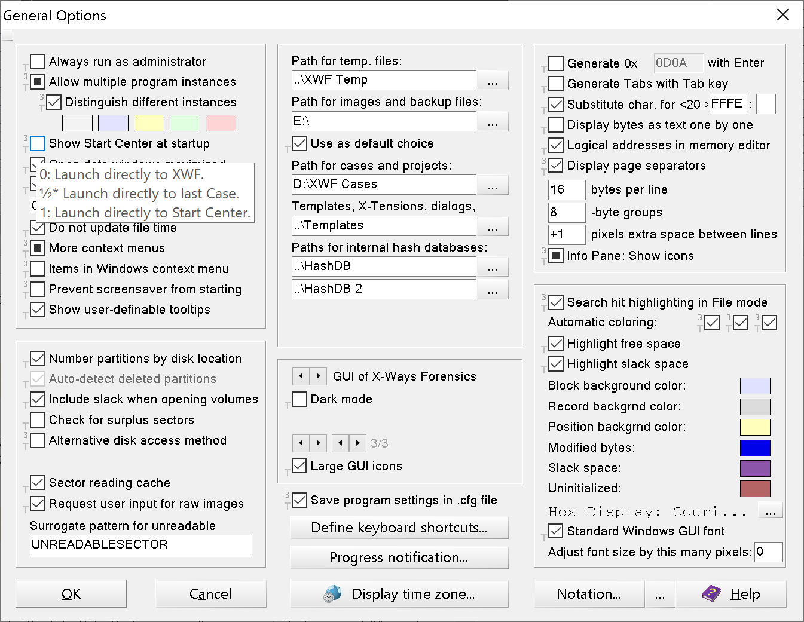
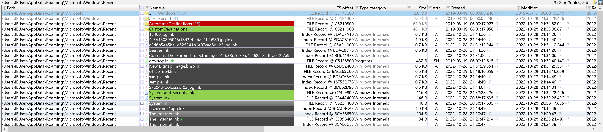
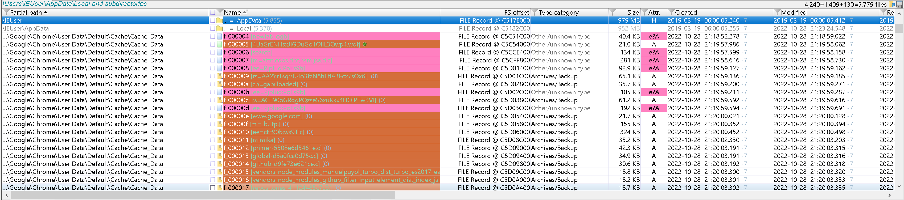
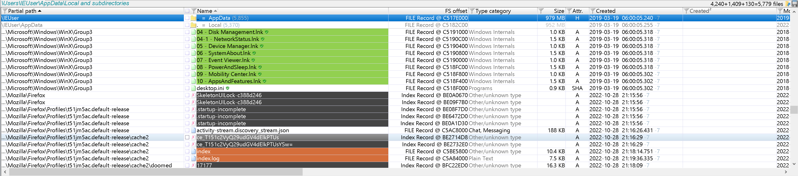

# X-Ways Forensics Resources

## Tooltips.txt
I created the official Tooltips.txt that was included in XWF versions 20.5 through 20.7.  In the meantime I began working on a replacement and unbeknownst to me so did one of the XWF developers.  Starting with version 20.8, XWF replaced Tooltips.txt with their internally developed one.  When I finally finished my updated Tooltips.txt, XWF declined to use it.  This repo contains a copy of my new Tooltips.txt for anyone that is interested in using it.

Notable Features:
1. The results of checking a box are clearly and concisely defined.  
   0 = unchecked  
   ½ = half checked  
   1 = fully checked
2. The XWF default state for a check box is defined with a '*' character.
3. Important points are called out with a '!' character such as when XWF needs to be running as Admin or when a checkbox will set a registry key on your local system.

## Conditional Coloring.cfg
I have taken all of the artifacts from the SANS FOR500 (red) poster and converted them into conditional coloring rules.  Applying the rules will cause the "Name" column for an artifact to be highlighted with roughly the same color as the poster.  Additionally, the color pink is used to highlight and callout encrypted files in general since those are probably important.  This config gives you over 100 rules which you can immediately use or disable individually if you find one that you don't like.

## Installation
If installing Conditional Coloring.cfg, go to Options -> Directory Browser -> "Store dir. browser settings in cases" and make sure it is unchecked.  When XWF is not running, replace the included file (Tooltips.txt or Conditional Coloring.cfg) in the main XWF installation directory with the one from this repo.  Launch XWF and enable the associated feature if it is not already turned on.
